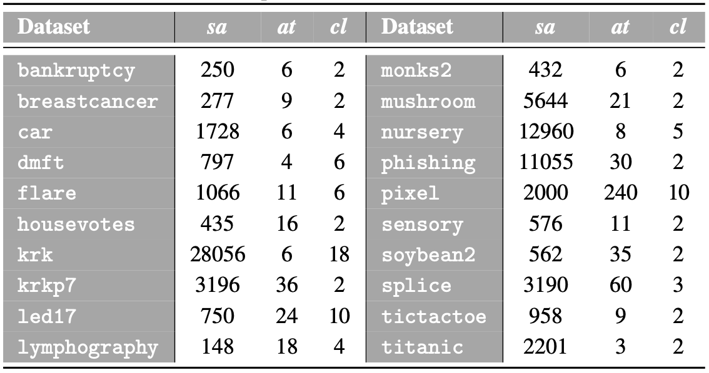

 

This webpage contains complementary material to the research paper:

| | |
|:---|:---|
||José A. Sáez, Pedro A. García. **Novel noise models for categorical attribute error simulation in classification**. [Knowledge-Based Systems](https://www.sciencedirect.com/journal/knowledge-based-systems). 2022; 10(14):2538.|
| | |

 

The web is organized according to the following summary:

1. [Abstract](#Abstract)
2. [Real-world datasets](#Datasets)
3. [Target shift and error estimation results](#Performance)

 
 
##  1. Abstract
Noise models are commonly used for controlled experimentation with noisy classification data, improving understanding of error impacts and supporting the development of mitigation strategies. However, attribute noise models, particularly for categorical variables, have received limited attention in the literature and typically generate simple corruptions using uniform random noise. This paper presents a novel methodology to simulate categorical attribute noise through 25 models reflecting realistic errors arising from data collection, coding and transcription. Each model employs a different probabilistic approach to determine which data values are corrupted and how the resulting noise is assigned. The impact of each type of noise is examined through extensive experiments on thousands of noisy datasets with different corruption levels affecting the training sets and, additionally, the test sets. These datasets are then used to evaluate the robustness of classification algorithms from different paradigms, such as decision trees, rule-based systems and ensemble methods, analyzing their behavior under real-world noisy scenarios not previously studied. These contributions offer a solid foundation for future studies on categorical attribute noise and provide valuable insights for experiments involving such errors in classification datasets.
 
##  2. Real-world datasets

The experimentation is based on 20 real-world datasets of a different nature taken from the *UCI* and *OpenML* repositories. The next table summarizes their main characteristics, including the number of samples (*sa*), which ranges from 148 to 28056, the number of categorical attributes (*at*), from 3 to 240, and the number of classes (*cl*), from 2 to 18. Samples containing missing values are removed before analysis.

These datasets can be downloaded from the webpages:
- [UCI Machine Learning Repository](https://archive.ics.uci.edu/)
- [OpenML Repository](https://www.openml.org/)

Additionally, these datasets can be downloaded [here](https://github.com/joseasaezm/categnoise/raw/main/docs/data.zip).

 

##  3. Performance results under categorical attribute noise

|||
|:---|:---:|
|&nbsp;&nbsp;&nbsp;**-** *Performance results (noisy train / clean test)* | |
|&nbsp;&nbsp;&nbsp;**-** *Performance evolution plot (noisy train / clean test)* | |
|&nbsp;&nbsp;&nbsp;**-** *Performance plots of robust algorithms (noisy train / clean test)* | |
|&nbsp;&nbsp;&nbsp;**-** *Performance results (noisy train / noisy test)* | |
|&nbsp;&nbsp;&nbsp;**-** *Performance evolution plot (noisy train / noisy test)* | |
|&nbsp;&nbsp;&nbsp;**-** *Performance plots of robust algorithms (noisy train / noisy test)* | |

|||
